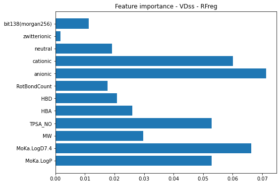

# human-iv-pk
Modeling human intravenous (IV) pharmacokinetic (PK) parameters from data collected by [*Lombardo, F et al. 2018*](https://dmd.aspetjournals.org/content/early/2018/08/16/dmd.118.082966).

## Project

### Project Target
In this project I've explored the PK data and tried to fit models on 2 PK parameters: 

- steady-state volumn of distribution (VD<sub>ss</sub>) 
- human clearance in plasma (CL<sub>p</sub>)
 
Although other PK parameters, e.g. half-life (t<sub>1/2</sub>), mean residence time (MRT) are not modeled here, the package `ivpk` is easily extendable to these targets.

Considering data missingness, the 2 targets were predicted separately to not waste data with missing target value.

### Requirements
- rdkit
- pytorch
- numpy
- pandas
- scikit-learn
- skorch
- matplotlib
- seaborn
- missingno

### Repository Structure
This repository consists of several directories, jupyter notebooks and python scripts:
```
.
├── configs/
├── data/
├── doc/
├── figures/
├── ivpk/
├── models/
├── results/
├── submission/
├── *.ipynb
├── *.py
└── ...
```
#### Directories
- configs: YAML configuration on model and GridSearchCV.
- data: raw, intermidiate and example data
- doc: leaderboard, slide doc for presentation
- figures: visualization results
- `ivpk`: python package for this project
- models: saved models
- results: prediction results
- submission: results predicted by selected models on test set as final submission

#### Notebooks
Notebooks following the order of analysis:
1. [EDA](EDA.ipynb): explore data, get a basic idea of the data and form strategy of preprocessing.
2. [Preprocessing](Preprocessing.ipynb): implementation and test of preprocessing methods.
3. [Train_val_test_split](Train_val_test_split.ipynb): split data strategy.
4. [Baseline_models_VDss](Baseline_models_VDss.ipynb) and [Baseline_models_CL](Baseline_models_CL.ipynb): simple models as baseline: linear regression, LASSO regression, Random Forest Regressor and SVR. The hyperparameters are not tuned.
5. [MLP_head](MLP_head.ipynb): try MLP as regressor.
6. [MLP_head_skorch](MLP_head_skorch.ipynb): wrap MLP by `skorch` for hyperparameter tuning and easy comparison with sci-kit learn regressors.
7. [Model_selection](Model_selection.ipynb): make prediction on test set, generate leaderboard, select best models for making submission.
8. [Submission](Submission.ipynb): take the selected models, make submission, analyze model and results.

#### Scripts
Command line tools for execution on cluster:
1. [gridsearch_cv.py](gridsearch_cv.py): grid search on train + validation set to find best hyperparameters, input config YAML saved in [configs/](configs/)
2. [train_mlp.py](train_mlp.py): train MLP head by given hyperparameters, train and val set defined by fixed seed for reproducibility.
3. [pred_from_raw.py](pred_from_raw.py): make prediction from raw data, using the best estimator so far.

Making prediction using example data:
```bash
python pred_from_raw.py --csv data/example_for_pred.csv
```
Note that the column names should be exact but column order is not strict.

## Data

### Data cleaning
Prune data:

- 2 records (550, 554) share same SMILES but different VDss and CL
- 10 records have SMILES string which cannot be recognized by rdkit

Use the remaining 1340 records for modeling.

### Train-val-test split
Here we'll use historical data to predict new data. Compounds with *Year of first disclosure* >= 2000 are our test set. Train - validation split on the remaining was done by `sklearn.model_selection.train_test_split` with fixed `random_seed` for reproducibility.

### Input data
Input data comes from 2 parts:
- Preprocessed physiochemical values (provided in raw data)
- Fingerprints

Available fingerprints are: Morgan (radius fixed as 2, bit size adjustable), RDkit fingerprint, MACCS keys. To use different fingerprint method for input, just change the argument `fpType`. For time consideration I only tested morgan fingerprints.

We chose Morgan Fingerprint at radius 2, bit size 256 for later models after several experiments. We didn't use the default bit size 2048 since the training data size is below 1000.

It seems the MACCS keys might be a better input method than Morgan FP after a small experiment in scratchpad notebook.

## Methods

Models tested for baseline: Linear regressor, LASSO regressor, Random Forest Regressor, SVR, MLP.

LASSO, Random Forest regressor and MLP have hyperparameters tuned by GridSearchCV on train + validation set (test set remained hidden). MLP regressor head with optimized hyperparameters was retrained on training set, using validation set for early stopping.

Predict on test set by models registered in [models/model_registration.yaml](models/model_registration.yaml), best results were submitted.

[Chemprop](https://github.com/chemprop/chemprop) was applied on same set of train-val-test split (no ensemble). Hyperparameters were default. Chemprop was used on either SMILES-ony or SMILES & preprocessed-physiochemical properties (see leaderboard).

## Results

Leaderboards were generated in [Model_selection notebook](Model_selection.ipynb) and saved to [doc](doc/) folder. Leaderboard in CSV format were converted to markdown on [tableconvert.com](https://tableconvert.com/).

### Leaderboard

Values were rounded to 4 digits.

Note:
1. GridSearchCV models were refit on train + val set, so the metrics for train / val is not comparable with others.
2. Only GridSeachCV models have the MAE_cv derived from their `best_score_`.
3. *mlp_* models other than *mlp_gridsearch* were retrained only on training set, using best hyperparameters from gridsearch.
4. chemprop training log doesn't provide overall training loss, just batch-wise loss at a default frequency (10 batches).
5. Pearson correlation coefficient were not calculated yet. The coefficient of determination (r2) can be found in chemprop training log.


#### Leaderboard for VDss

|                   | MAE_train | Pearsonr_train | MAE_val | Pearsonr_val | MAE_test | Pearsonr_test | MAE_cv |
|-------------------|-----------|----------------|---------|--------------|----------|---------------|--------|
| lasso02_morgan256 | 1.0541    | 0.7544         | 1.1299  | 0.7475       | 1.4856   | 0.5478        |        |
| rfreg_morgan256   | 0.3988    | 0.974          | 1.0749  | 0.7626       | 1.4318   | 0.5206        |        |
| lasso_gridsearch  | 1.0734    | 0.7406         | 1.0568  | 0.7882       | 1.4591   | 0.5686        | 1.1635 |
| **rfreg_gridsearch**  | 0.3849    | 0.979          | 0.3869  | 0.9815       | **1.3808**   | **0.5748**        | 1.0687 |
| mlp_gridsearch    | 0.6163    | 0.9313         | 0.6037  | 0.9385       | 1.5647   | 0.5129        | 1.1679 |
| mlp_morgan256     | 0.9018    | 0.8274         | 0.9257  | 0.8313       | 1.4835   | 0.5386        |        |
| mlp_morgan2048    | 0.8838    | 0.8366         | 0.9155  | 0.8427       | 1.3971   | 0.58          |        |
| chemprop_smiles    |           |                | 1.0718  |             | 1.4932   |               |        |
| chemprop_properties|           |                | 0.9834  |             | 1.3801   |               |        |


#### Leaderboard for CL

|                  | MAE_train | Pearsonr_train | MAE_val | Pearsonr_val | MAE_test | Pearsonr_test | MAE_cv |
|------------------|-----------|----------------|---------|--------------|----------|---------------|--------|
| rfreg_morgan256  | 0.5166    | 0.9735         | 1.3942  | 0.4578       | 1.5448   | 0.2333        |        |
| rfreg_gridsearch | 0.5054    | 0.9786         | 0.5041  | 0.9749       | 1.5147   | 0.2719        | 1.3899 |
| mlp_gridsearch   | 1.3834    | 0.5903         | 1.3711  | 0.5618       | 1.5021   | 0.2762        | 1.5173 |
| **mlp_morgan256**    | 1.4023    | 0.5641         | 1.3804  | 0.5398       | **1.4894**   | **0.2893**        |        |
| chemprop_smiles    |           |                | 1.3454  |         | 1.4943   |          |        |
| chemprop_properties|           |                | 1.3447  |         | 1.5768   |          |        |


### Submission

#### VDss test set


#### CL test set


## Discussion

### Modeling performance

Clearly the results are not satisfactory, especially for CL. MAE about 1.38-1.49 on log2 value means a 2.6-2.8 fold average error.

CL is a high-bias case which tells us that physiochemical properties + fingerprint might not be sufficient.

Chemprop is comparable with our best models. Here we only used SMILES (and pre-calculated physiochemical properties) as input. If fingerprint was added, performance might increase a little. Examine the training log we can see the high-variance issue, thus regularization on chemprop models could be helpful. 

### Feature importance

For VDss, the best predictor is a Random Forest Regressor, we can examine its feature importance.



Clearly, the physiochemical properties are far more important than fingerprints. 

We can highlight the most important bit on chemicals for model interpretation, for example:


Or:  


### Future works

This project is just a proof-of-concept. A lot can be improved. 

From modeling perspective:
- Chemprop is a good starting point on exploring graphic-neural-networks. Here I just dipped the water but there's definitely more to explore, either using chemprop's elegant framework or adopting new message passing algorithms. 
- Beside GNN, SMILES can be interpreted as string suitable for language models. A staring point could be the [smiles_transformer](https://github.com/DSPsleeporg/smiles-transformer).

From data perspective:
- We could explore public datasets for additional information to support modeling, e.g. [ChEMBL](https://www.ebi.ac.uk/chembl/). 
- Other descriptors can be tested. For example, we could generate descriptors by [Mordred](https://jcheminf.biomedcentral.com/articles/10.1186/s13321-018-0258-y) and evaluate their relavance with PK targets.
- It is benefitial to examine which compounds are easier to predict and which are hard. I've saved those hard samples (absolute error > 1) to *results/* folder.  

For model serving:
- We can try implementing physiochemical value calculation so that we only need SMILES as the only input.


It is a common requirement to build a framework that can efficiently link tasks, data and models. Beside the elegant chemprop, a systematic pipeline, [ATOM Modeling PipeLine (AMPL)](https://github.com/ATOMconsortium/AMPL), could also be a reference.
